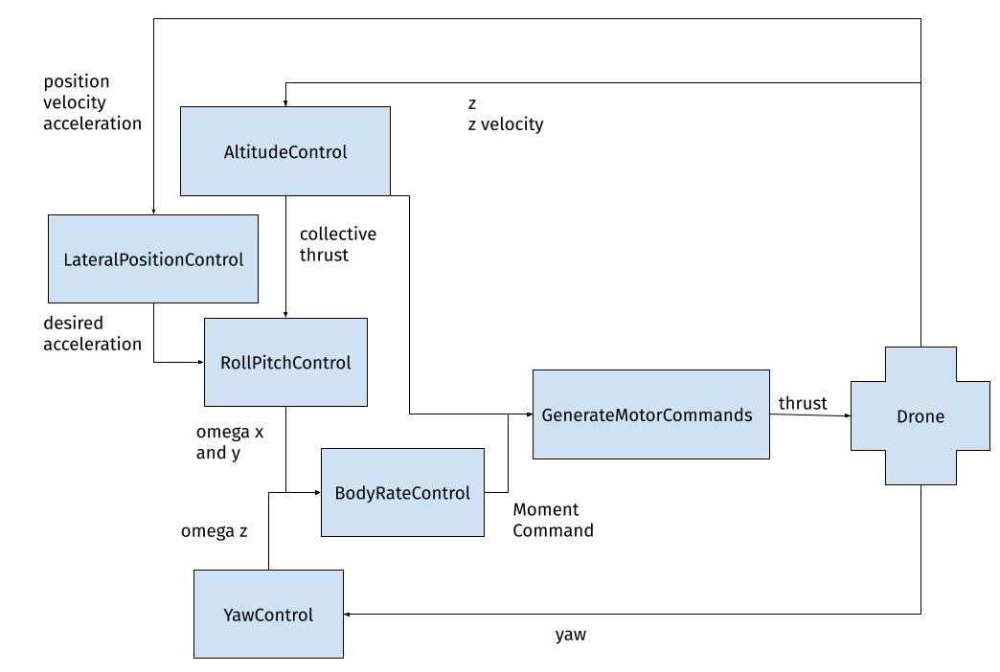

## Project: Control

In the Control project, I implemented a cascaded PID controller that takes the velocity, 
position and acceleration as inputs and outputs the thrust commands for the four motors.

The cascaded controller is comprised of five individual controllers as shown in the picture below.



The body rate control is implemented in the method ```QuadControl::BodyRateControl```. 

The roll pitch control is implemented in the method ```QuadControl::RollPitchControl```.

The altitude controller is implemented in the method ```QuadControl::AltitudeControl```.

The lateral position control is implemented in the method ```QuadControl::LateralPositionControl```.
 
The yaw control is implemented in the method ```QuadControl::YawControl```.

To determine the values for the proportional, derivative and integral constants of the controllers, 
I used the directions from the C++ project readme. For the ```QuadControlParams.kpPQR``, I started with double the values 
indicated in the Tips and Tricks, and increased them until scenario 2 passed. I had to come back to 
this step several times to be able to pass scenario 4. I used the same procedure for ```QuadControlParams.kpBank```.

For the ```QuadControlParams.kpPosXY``` and ```QuadControlParams.kpPosZ```, I had to increase the values an order 
of magnitude above the recommended 2-4 times the given values. 
I had to decrease ```QuadControlParams.kpVelXY``` and ```QuadControlParams.kpVelZ``` from the four times constants 
for  the position to less than half.
